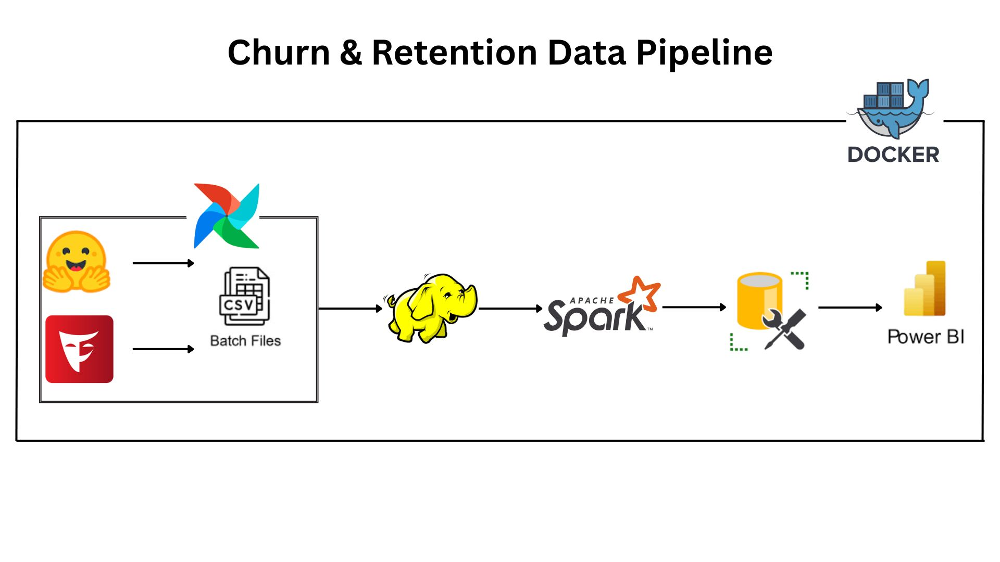

# Churn-Retention-Pipeline
This project demonstrates a complete ETL pipeline for analyzing Telco Customer Churn.
The pipeline covers data generation, orchestration, processing, storage, and visualization, showcasing a full Data Engineering workflow from raw data to actionable insights.

## 📚 Contents

📌 Business Case
📁 Data Source
🧰 Tools and Technologies Used
🧱 Data Pipeline Architecture
🗄️ OLTP Database Description
📊 OLAP Dimensional Modeling (DWH)
⚙️ ETL and Data Flow
🧪 Data Validation and Quality
📈 Dashboards and Reports
🚀 How to Run the Project
✅ Future Improvements

## 1. 📌 Business Case

The project aims to analyze customer churn in the telecommunications sector.
Identify customers at risk of leaving and understand retention patterns to improve marketing strategies and customer service.

## 2. 📁 Data Source

Original dataset: Telco Customer Churn Dataset
 from Hugging Face.
Synthetic data generated using Faker library to expand the dataset size for more realistic scenarios.

## 3. 🧰 Tools and Technologies Used

Airflow: workflow orchestration & scheduling
HDFS: data storage for raw and processed data
Apache Spark: data processing & transformations
SQL Server (SSMS): OLTP & DWH storage
Power BI: visualization and reporting
Python Libraries: pandas, faker, datasets

## 4. 🧱 Data Pipeline Architecture

##5. 🗄️ OLTP Database Description
Tables for Raw/Transactional Data:
customer
subscription
usage

Primary Keys & Relationships:
customer_id as primary key in the main table
All other tables are linked to customer_id

## 6. 📊 OLAP Dimensional Modeling (DWH)

Star Schema design for churn analysis:
Fact Table: fact_churn
Dimension Tables: dim_customer, dim_subscription, dim_time
Supports analysis of:
Churn rate by age, gender, and city
Average customer usage over time

7. ⚙️ ETL and Data Flow

Data Ingestion: fetch original dataset + synthetic Faker data
Orchestration: Airflow DAGs to manage ETL workflow
Storage: save raw and processed data in HDFS
Transformation: clean, transform, and prepare data using Spark
Load: store transformed data in SQL Server (DWH)
Visualization: create dashboards in Power BI

8. 🧪 Data Validation and Quality

Ensure no missing values
Validate data types for all columns
Enforce referential integrity between tables

9. 📈 Dashboards and Reports

Power BI dashboards show:
Monthly churn rate
Geographical distribution of churn
Churn trends by plan and customer demographics
Customers at risk of leaving

10. 🚀 How to Run the Project

Clone the repository
git clone https://github.com/omarmaher0/Churn-Retention-Pipeline
cd Telco-Customer-Churn-ETL-Pipeline

Install requirements

pip install -r requirements.txt

Set up and run Airflow

airflow db init
airflow webserver -p 8080
airflow scheduler

Run ETL DAG via Airflow UI
Verify data in HDFS → Spark → SQL Server
Open Power BI and connect to SQL Server to visualize dashboards

11. ✅ Future Improvements

Add real-time streaming using Kafka for live churn monitoring
Enhance analysis with ML models to predict at-risk customers
Implement data quality checks & alerts in Airflow DAGs
Expand dashboards to include CLV and LTV metrics
