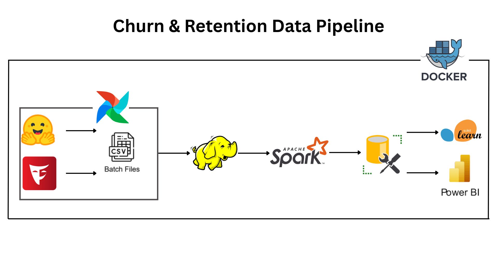
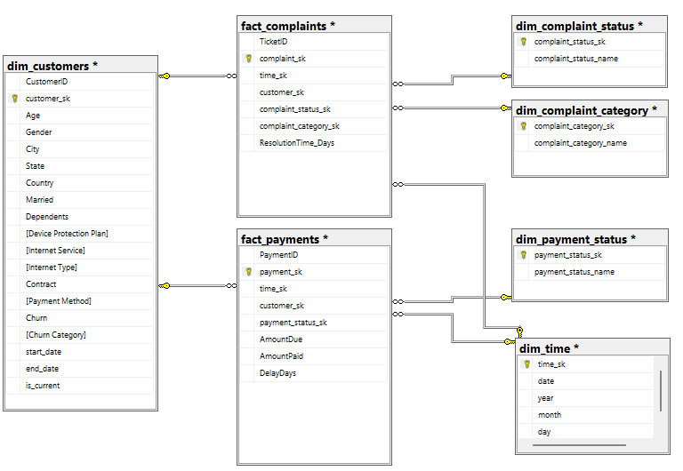
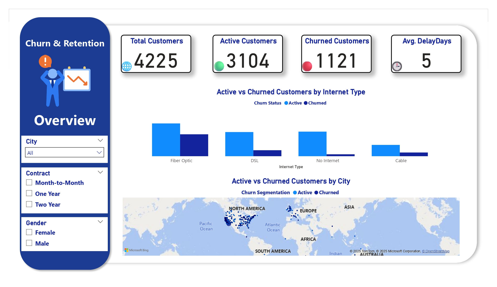

# 📉📈 Churn Retention Pipeline
This project demonstrates a complete ETL pipeline for analyzing Telco Customer Churn.
The pipeline covers data generation, orchestration, processing, storage, and visualization, showcasing a full Data Engineering workflow from raw data to actionable insights.

## 📚 Contents

1. 📌 Business Case
2. 📁 Data Source
3. 🧰 Tools and Technologies Used
4. 🧱 Data Pipeline Architecture
5. 🗄️ OLTP Database Description
6. 📊 OLAP Dimensional Modeling (DWH)
7. ⚙️ ETL and Data Flow
8. 🧪 Data Validation and Quality
9. 📈 Dashboards and Reports
10. 🚀 How to Run the Project
11. ✅ Future Improvements

## 1. 📌 Business Case

The project aims to analyze customer churn in the telecommunications sector.
Identify customers at risk of leaving and understand retention patterns to improve marketing strategies and customer service.

## 2. 📁 Data Source

1. Original dataset: Telco Customer Churn Dataset from Hugging Face.
2. Synthetic data generated using Faker library to expand the dataset size for more realistic scenarios.

## 3. 🧰 Tools and Technologies Used

1. Airflow: workflow orchestration & scheduling
2. HDFS: data storage for raw and processed data
3. Apache Spark: data processing & transformations
4. SQL Server (SSMS): OLTP & DWH storage
5. Power BI: visualization and reporting
6. Python Libraries: pandas, faker, datasets

## 4. 🧱 Data Pipeline Architecture




## 5. 🗄️ OLTP Database Description
Tables for Raw/Transactional Data:
customer
subscription
usage

Primary Keys & Relationships:
customer_id as primary key in the main table
All other tables are linked to customer_id

## 6. 📊 OLAP Dimensional Modeling (DWH)





## 7. ⚙️ ETL and Data Flow

1. 📥 Data Ingestion: Fetch the original dataset from Hugging Face and generate synthetic data using Faker
2. 🛠️ Orchestration: Use Airflow DAGs to manage the ETL workflow
3. 🗄️ Storage: Save raw and processed data in HDFS
4. 🔄 Transformation: Clean, transform, and prepare data using Apache Spark
5. 💾 Load: Store transformed data into SQL Server (DWH)
6. 📊 Visualization: Create interactive dashboards in Power BI

## 8. 🧪 Data Validation and Quality

1-Checked the dataset for missing values and validated data types for all columns.
2-Ensured referential integrity between tables.

Handling Missing Values:
1-churn_category & churn_reason
These columns had null values because some customers did not churn.
Filled the missing values with "Not Churned" to clearly distinguish non-churned customers.

2-internet_type
Null values indicated that some customers did not subscribe to any internet service.
Filled the missing values with "No Internet" to reflect this.

3-offer
Null values appeared for customers without any special offer.
Filled the missing values with "No Offer" to clearly identify customers without promotions.

After handling missing values, the dataset was clean, consistent, and ready for transformation in the ETL pipeline.

## 9. 📈 Dashboards and Reports

Power BI dashboards show:
Monthly churn rate
Geographical distribution of churn
Churn trends by plan and customer demographics
Customers at risk of leaving




## 10. 🚀 How to Run the Project

Clone the repository
```bash
git clone https://github.com/omarmaher0/Churn-Retention-Pipeline
cd Telco-Customer-Churn-ETL-Pipeline
```

Install requirements
```powershell

pip install -r requirements.txt
```

Set up and run Airflow
```powershell

airflow db init
airflow webserver -p 8080
airflow scheduler
```

Run ETL DAG via Airflow UI
Verify data in HDFS → Spark → SQL Server
Open Power BI and connect to SQL Server to visualize dashboards

## 11. ✅ Future Improvements

Add real-time streaming using Kafka for live churn monitoring
Enhance analysis with ML models to predict at-risk customers
Implement data quality checks & alerts in Airflow DAGs
Expand dashboards to include CLV and LTV metrics
